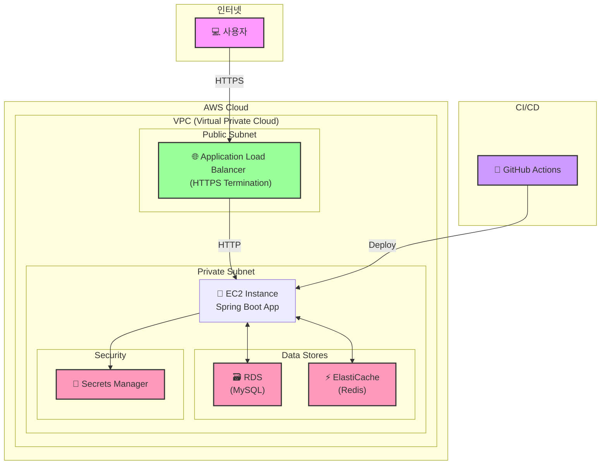

# VitaCheck Backend Server 💊
<p align="center">
  
</p>

## 📖 프로젝트 소개
* ```비타체크(VitaCheck)```는 사용자가 섭취하는 영양제를 분석하고, 개인의 건강 상태에 맞춰 필요한 영양제를 추천해주는 지능형 건강 관리 서비스입니다. 넘쳐나는 정보 속에서 사용자가 자신에게 맞는 영양제를 스마트하게 선택하고 섭취할 수 있도록 돕습니다.


### 주요 기능
* **영양제 검색**: 국내 유통되는 3만 개 이상의 영양제 정보 및 성분 검색
* **조합 분석**: 현재 섭취 중인 영양제들의 성분 조합을 분석하여 과다/부족 성분 시각화
* **개인화 추천**: 사용자 정보(나이, 성별) 및 건강 관심사에 기반한 맞춤 영양제 추천
* **섭취 관리**: 섭취 알림 등록 및 섭취 여부 체크 기능
* **커뮤니티**: 영양제 관련 정보를 공유하고 소통하는 공간

---

## 🛠️ 기술 스택
| 구분 | 기술 |
| --- | --- |
| **Backend** | Java 17, Spring Boot 3.x, Spring Security, Spring Data JPA |
| **Database** | MySQL, Querydsl, Redis (캐싱) |
| **DevOps** | AWS EC2, AWS RDS, Nginx, GitHub Actions |
| **Etc** | JWT, Lombok, Swagger (Springdoc) |

---

## 🏗️ 서버 아키텍처
비타체크 백엔드 서버는 AWS 클라우드 환경에 배포되며, 안정성과 확장성을 고려하여 설계되었습니다. 사용자의 요청은 Nginx를 통해 Spring Boot 애플리케이션으로 전달되며, 데이터는 RDS와 Redis에 저장 및 관리됩니다.


### 🌿 브랜치 전략 및 협업 규칙

저희 프로젝트는 ```Forking Workflow```를 기반으로 한 브랜치 전략을 사용합니다. ```중앙 원격 저장소(upstream)```의 ```develop``` 브랜치를 보호하고, 코드 리뷰를 통해 안정적인 코드 통합을 지향합니다.

* ```main```: 릴리즈를 위한 최종 안정화 브랜치
* ```develop```: 현재 섭취 중인 영양제들의 성분 조합을 분석하여 과다/부족 성분 시각화

**작업 흐름**

1. 중앙 저장소(```VitaCheck/vitacheck-be```)를 자신의 계정으로 **Fork**합니다.

2. Fork한 개인 원격 저장소를 로컬 환경에 **Clone**합니다.

3. 기능 개발을 위해 ```develop``` 브랜치를 기준으로 ```feature/기능명``` 브랜치를 생성합니다.

4. 기능 개발 완료 후, 커밋 메시지 규칙에 맞춰 **Commit**합니다.

5. 개인 원격 저장소의 ```feature``` 브랜치로 **Push**합니다.

6. 개인 저장소에서 중앙 저장소의 ```develop``` 브랜치로 **Pull Request/(PR/)**를 생성합니다.

7. 팀원의 코드 리뷰 및 승인(Approve) 후, PR을 **Merge**합니다.
---

## 📁 프로젝트 구조

```
vitacheck-be/
├── .github/              # GitHub 이슈/PR 템플릿, CI/CD 워크플로우
│
├── gradle/               # Gradle 빌드 시스템 관련 파일
│
├── src/                  # 전체 소스 코드
│   ├── main/             # 실제 애플리케이션 소스 코드
│   │   ├── java/         # 자바 소스 코드 루트
│   │   │   └── com/vitacheck/
│   │   │       ├── config/       # Spring Security, JWT, Swagger 등 핵심 설정
│   │   │       ├── controller/   # API 엔드포인트(경로) 정의
│   │   │       ├── domain/       # 데이터베이스 테이블과 매핑되는 핵심 객체(Entity)
│   │   │       ├── dto/          # 데이터 전송 시 사용되는 객체
│   │   │       ├── exception/    # 커스텀 예외 처리
│   │   │       ├── global/       # 전역적으로 사용되는 응답 형식, 예외 핸들러
│   │   │       ├── repository/   # 데이터베이스 접근(CRUD) 로직
│   │   │       ├── service/      # 핵심 비즈니스 로직
│   │   │       └── util/         # 보조 기능 유틸리티
│   │   │
│   │   └── resources/    # 설정 파일(application.yml)
│   │
│   └── test/             # 테스트 코드
│
└── .gitignore            # Git이 추적하지 않을 파일/폴더 목록
```

---

## 🧑‍💻 팀원 정보
<br>

**🚀 김태우 (Backend Developer)**
- **GitHub**: [@TAEW00KIM](http://github.com/TAEW00KIM)
- **Portfolio**: [taewoo-portfolio.com](https://ash-ceder-77b.notion.site/1ffe1dfb86ef80d798d5c3f46af2199a)
- **Email**: twkk0819@gmail.com
- **Instagram**: [taeoowkm](https://www.instagram.com/taeoowkm/)
- **한 줄 소개**: 비타체크의 안정적인 백엔드 시스템을 구축합니다.

---

**🚀 박지영 (Backend Developer)**
- **GitHub**: [@lee-nada](https://github.com/lee-nada)
- **Email**: lee-nada@example.com
- **한 줄 소개**: 사용자를 위한 빠르고 정확한 API를 만듭니다.

---

**🚀 이나영 (Backend Developer)**
- **GitHub**: [@bewheneverwhatiwant](https://github.com/bewheneverwhatiwant)
-  **Email**: lny021102@hufs.ac.kr
- **한 줄 소개**: 클라이언트가 필요한 데이터를 정확하고 빠르게 전달하기 위해 노력합니다.

---

**🚀 김예준 (Backend Developer)**
- **GitHub**: [@park-rama](https://github.com/park-rama)
- **Portfolio**: [rama-portfolio.com](https://rama-portfolio.com)
- **한 줄 소개**: 대용량 데이터 처리와 성능 최적화에 관심이 많습니다.

---

**🚀 김민범 (Backend Developer)**
- **GitHub**: [@minHorang](https://github.com/minHorang)
- **Portfolio**: https://icy-aluminum-ea9.notion.site/portfolio-minbeom?source=copy_link
- **Email**: orum1223@dgu.ac.kr
- **한 줄 소개**: 개발자가 되고 싶은 감자입니다.
